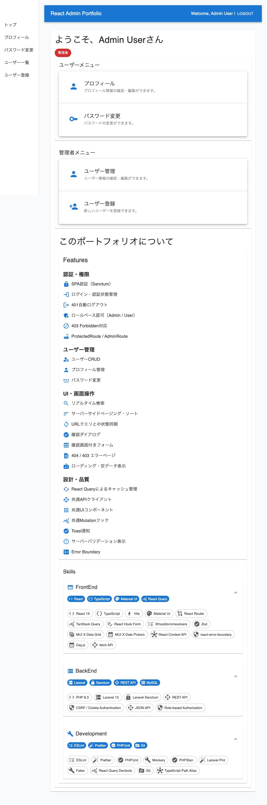
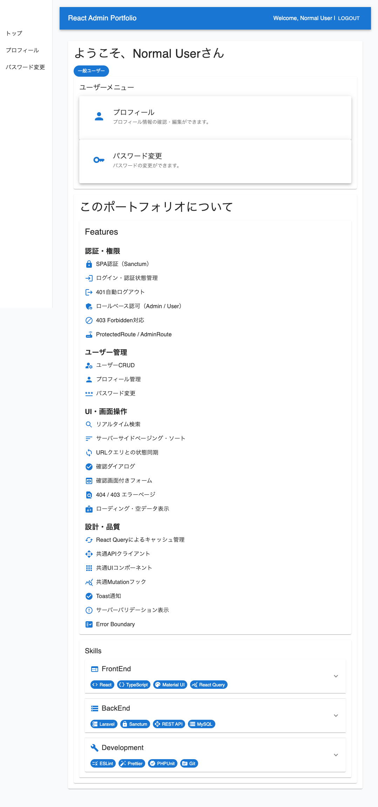
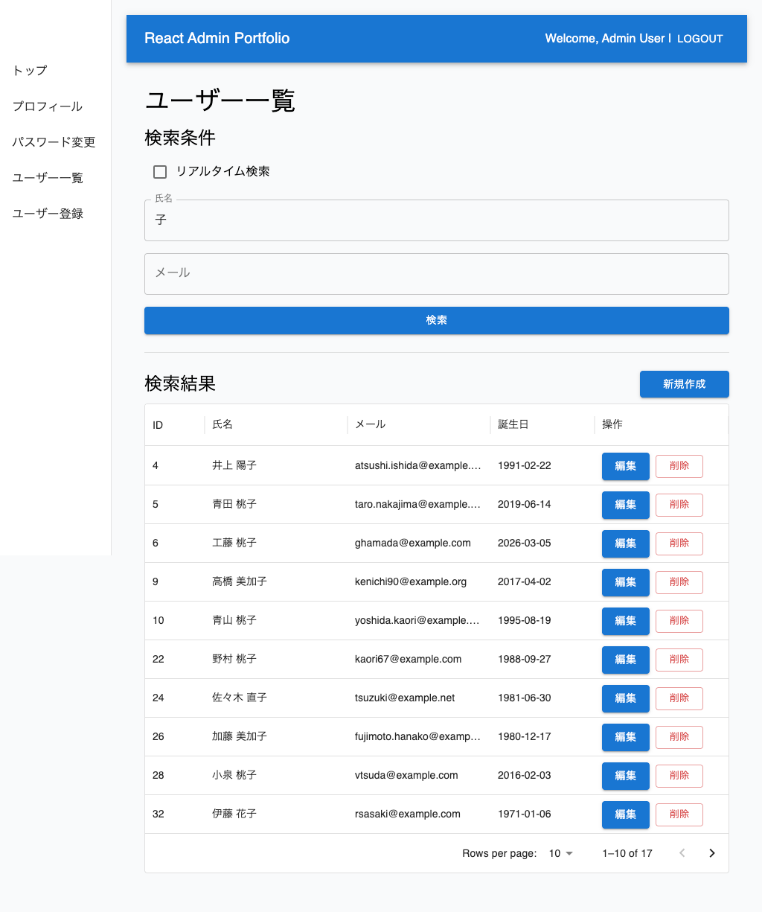
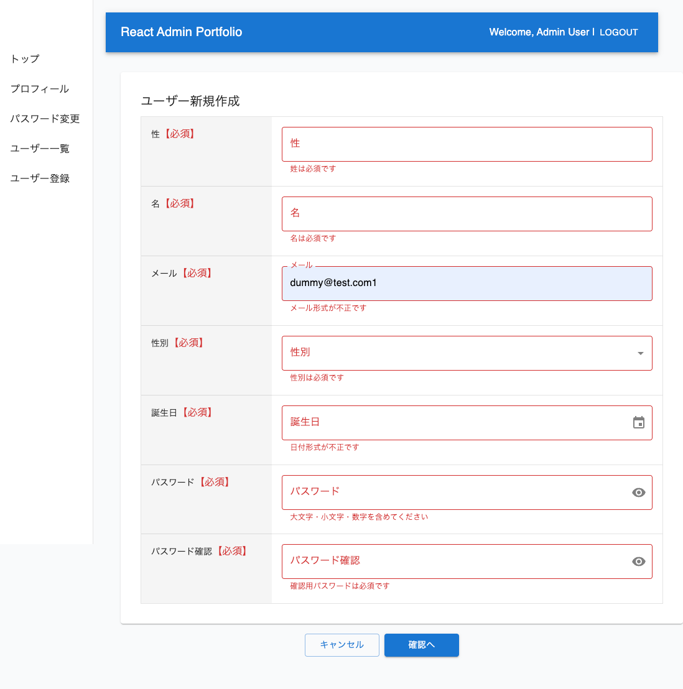
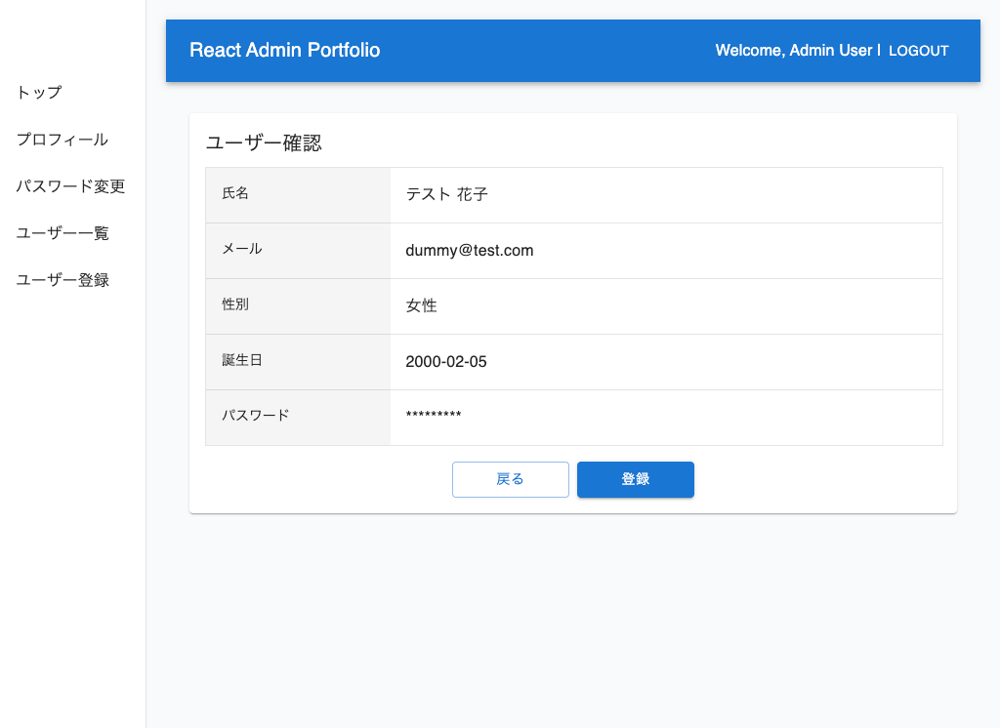
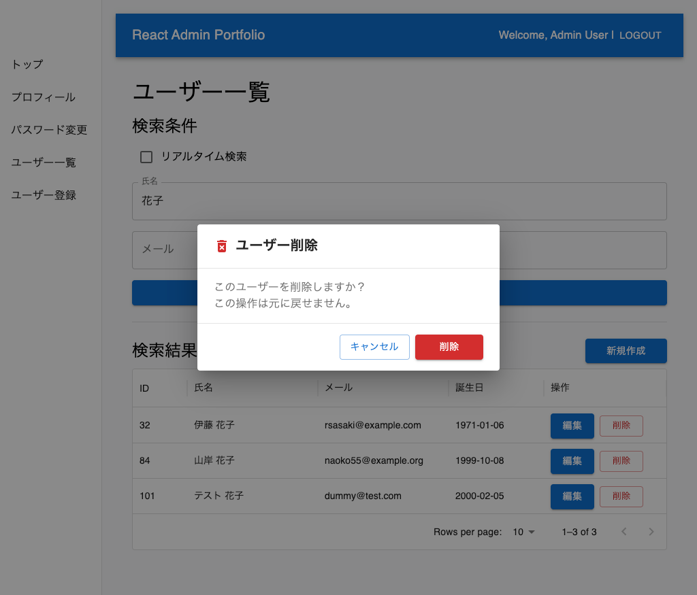
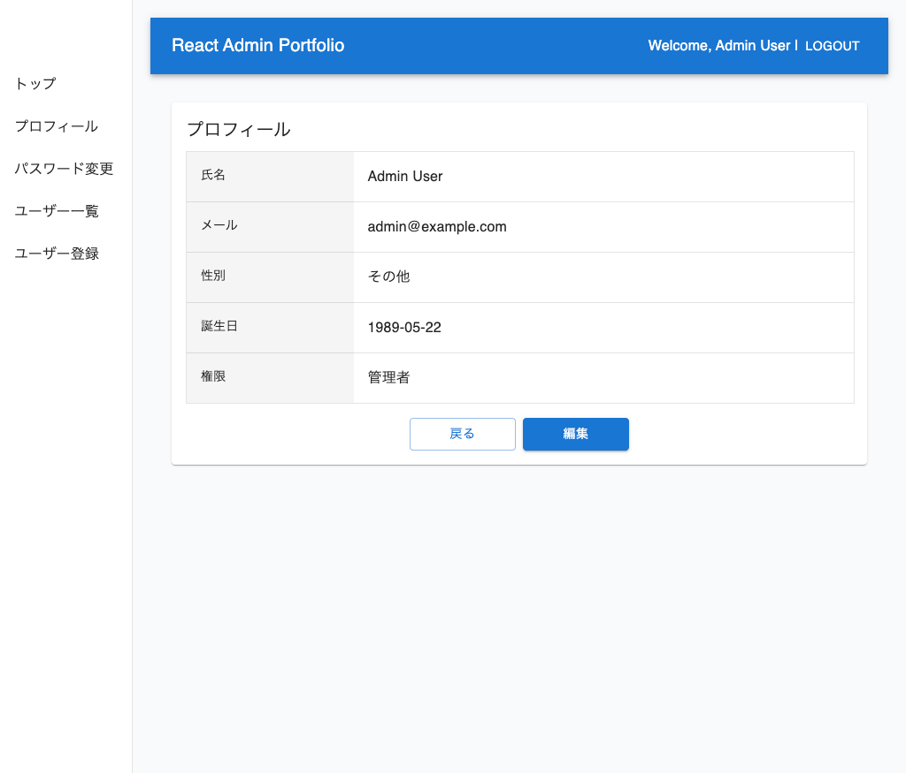
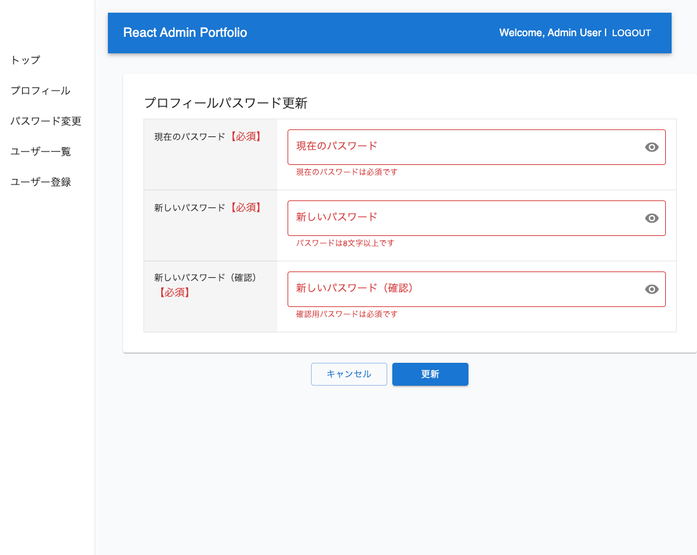

# Portfolio React Admin System


React 管理画面と Laravel REST API を組み合わせた、ポートフォリオ管理システムのモノレポです。フロントエンドとバックエンドを分離しながら、認証・権限管理・ユーザー管理・データ管理を一つの構成で提供します。

## 📋 プロジェクト概要

このリポジトリには、次の 2 つのアプリケーションが含まれています。

- フロントエンド: React + TypeScript + Material UI を用いた管理画面
- バックエンド: Laravel + Sanctum を用いた REST API

両者は Cookie ベースの認証で連携し、管理者・一般ユーザーの権限分離を実現しています。

## ✨ 主な機能

### フロントエンド

#### 認証・権限管理

- **SPA認証**: Laravel Sanctumによるクッキーベース認証
- **自動ログアウト**: 401エラー時の自動ログアウト処理
- **ロールベースアクセス制御（RBAC）**: AdminユーザーとUserロールによる権限分離
- **保護されたルート**: ProtectedRoute・AdminRoute による認証・権限チェック
- **エラーハンドリング**: 404/403エラーページの表示

#### ユーザー管理

- **ユーザーCRUD操作**: ユーザーの作成・読取・更新・削除
- **プロフィール管理**: 自身のユーザー情報編集
- **パスワード管理**: パスワード変更機能
- **管理者向けユーザー管理**: 管理画面でのユーザー一括管理

#### UI・UX

- **リアルタイム検索**: 大規模データセット内での即座フィルタリング
- **サーバーサイドページング・ソート**: MUI X Data Gridによる効率的なデータ読み込み
- **URLクエリ状態同期**: フィルタ・ページ・ソート状態をURLに保存
- **ローディング・空データ表示**: ユーザーフレンドリーなデータ取得状態UI
- **確認ダイアログ**: 削除・重要操作の安全な確認UI
- **複数ステップフォーム**: フォーム送信前プレビュー機能
- **レスポンシブUI**: モバイル・タブレット対応デザイン

#### 高度な状態管理・パフォーマンス

- **React Queryキャッシング**: インテリジェントなサーバー状態管理と自動更新
- **共通APIクライアント**: 中央集約化されたHTTPクライアント（インターセプター付き）
- **共通UIコンポーネント**: 再利用可能なMaterial UIコンポーネント ライブラリ
- **Toast通知**: グローバル通知システム
- **サーバー バリデーション表示**: API検証エラーのフォーム内表示
- **Error Boundary**: Reactエラーをキャッチしてグレースフルに表示

### バックエンド

#### 認証・セキュリティ

- **Laravel Sanctum**: クッキーベースのSPA認証
- **ロールベース権限管理（RBAC）**: AdminユーザーとUserロールの権限ポリシー
- **ミドルウェア保護**: 認証・管理者権限チェック
- **CSRF保護**: クロスサイトリクエスト偽造対策
- **セキュアなパスワード処理**: Bcryptハッシング

#### ユーザー管理

- **ユーザーAPI**: CRUD操作エンドポイント
- **プロフィール操作**: ユーザー情報・設定管理
- **パスワード管理**: セキュアなパスワード変更機能
- **ユーザーリスト**: ページング・フィルタ対応のユーザーリスト取得
- **管理者のみの操作**: 管理者権限が必要な操作の制御

#### API・データ処理

- **RESTful設計**: 標準HTTPメソッドとステータスコード
- **JSON API**: 一貫したJSONレスポンス形式
- **バリデーション**: サーバーサイド フォームリクエスト検証
- **詳細なエラーメッセージ**: 検証エラーの詳細情報提供
- **ページング**: 設定可能なページベースデータ ページング
- **包括的なエラーハンドリング**: 有意義なエラーレスポンス

#### 品質・テスト

- **PHPUnit**: 包括的なユニット・機能テスト
- **Mockeryを使用したモック**: テスト用モック機能
- **PHPStan**: 静的解析による型安全性チェック
- **Laravel Pint**: コードフォーマッティング
- **FakerPHP**: テスト用ダミーデータ生成
- **CI/CD**: GitHub Actionsによる自動品質チェック（ESLint・型チェック・PHPStan・PHPUnit）

## 📸 スクリーンショット

実際の画面を通して、権限分離・CRUD操作・入力バリデーション・確認フローといった実装ポイントを紹介します。

### ロールベースの画面表示（Admin / User）

管理者ユーザーでログインすると、ユーザー管理関連のメニューが追加表示されます。一般ユーザーには表示されないため、フロントエンド・バックエンド双方でロールに応じたアクセス制御を行っていることが分かります。

| 管理者ダッシュボード                                                                    | 一般ユーザーダッシュボード                                                                   |
| --------------------------------------------------------------------------------------- | -------------------------------------------------------------------------------------------- |
|  |  |

### ユーザー管理（検索・一覧・CRUD）

サーバーサイドページング対応の一覧画面から、検索・新規作成・編集・削除までを一気通貫で行えます。

**ユーザー一覧・検索**

氏名・メールでの絞り込みや、リアルタイム検索の切り替えに対応しています。



**ユーザー新規作成（入力バリデーション）**

必須項目チェックやメール形式・パスワード強度チェックなど、フォーム単位でのバリデーションをリアルタイムに表示します。



**登録内容の確認画面**

登録前に入力内容を確認できるステップを挟むことで、誤操作を防止しています。



**削除時の確認ダイアログ**

削除のような取り消しのできない操作の前には、確認ダイアログを表示して誤削除を防ぎます。



### プロフィール・パスワード管理

ログインユーザー自身の情報確認・編集や、パスワード変更を行えます。

| プロフィール確認                                                        | パスワード変更                                                                    |
| ----------------------------------------------------------------------- | --------------------------------------------------------------------------------- |
|  |  |

## 🛠 技術スタック

### フロントエンド

- **React** 19 / **TypeScript** 5.9
- **Vite** 7 (ビルドツール)
- **Material UI** 7 / **MUI X Data Grid** 8 / **MUI X Date Pickers** 8
- **React Query** 5 (サーバー状態管理)
- **React Hook Form** 7 (フォーム処理)
- **Zod** 4 (スキーマ検証)
- **React Router** 7 (ルーティング)
- **Day.js** 1 (日付操作)
- **ESLint** 8 / **Prettier** 3 (コード品質)

### バックエンド

- **PHP** 8.3 / **Laravel** 13
- **Laravel Sanctum** 4.3 (SPA認証)
- **MySQL** 8.0 (データベース)
- **PHPUnit** 12.5 / **Mockery** 1.6 (テスト)
- **PHPStan** 2.1 / **Laravel Pint** 1.29 (コード品質)
- **FakerPHP** 1.23 (テストデータ)

### 開発・CI

- **Docker** / **Docker Compose** (開発環境)
- **GitHub Actions** (CI/CD)
- **ESLint** / **Prettier** (フロントエンド コード品質)
- **Laravel Pint** / **PHPStan** (バックエンド コード品質)

## 🏗 アーキテクチャ

```text
Browser / Client
      │
      ▼
React Admin Frontend
      │
      │ HTTP / REST + Cookie Auth
      ▼
Laravel API Backend
      │
      ▼
MySQL Database
```

## 🔄 CI/CD

GitHub Actions を使用して、`main` ブランチへの push および pull request のたびにコード品質を自動検証しています。

### フロントエンド

- ESLint
- 本番ビルド

### バックエンド

- PHPStan
- PHPUnit

### ワークフロー

```text
Push / Pull Request
        │
        ├── フロントエンド
        │     ├── ESLint
        │     └── ビルド
        │
        └── バックエンド
              ├── PHPStan
              └── PHPUnit
```

Node.js と Composer の依存関係キャッシュを有効にし、CIの実行時間を短縮しています。フロントエンドとバックエンドは別ジョブとして実行され、それぞれ独立して品質チェックが行われます。

## 📁 ディレクトリ構成

```text
portfolio-react-admin-system/
├── backend/                # Laravel API
│   ├── app/
│   │   ├── Http/
│   │   │   ├── Controllers/     # API コントローラ
│   │   │   ├── Requests/        # フォーム検証リクエスト
│   │   │   └── Middleware/      # カスタムミドルウェア
│   │   ├── Models/              # Eloquentモデル
│   │   ├── Policies/            # 権限管理ポリシー
│   │   ├── Providers/           # サービス プロバイダ
│   │   └── Services/            # ビジネスロジック サービス
│   ├── database/
│   │   ├── migrations/          # データベース マイグレーション
│   │   ├── factories/           # テスト用モデル ファクトリ
│   │   └── seeders/             # データベース シーダー
│   ├── routes/
│   │   ├── api.php              # APIルート
│   │   └── console.php          # Artisanコマンド
│   ├── tests/
│   │   ├── Unit/                # ユニット テスト
│   │   └── Feature/             # 機能・統合テスト
│   ├── config/                  # 設定ファイル
│   └── ...
├── frontend/                # React 管理画面
│   ├── src/
│   │   ├── components/          # 再利用可能なUIコンポーネント
│   │   ├── features/            # 機能別モジュール（ユーザー、認証など）
│   │   ├── hooks/               # カスタムReactフック
│   │   ├── layouts/             # ページレイアウト
│   │   ├── pages/               # ルートページ
│   │   ├── router/              # React Router設定
│   │   ├── lib/                 # ユーティリティ・ヘルパー
│   │   ├── config/              # アプリケーション設定
│   │   ├── types/               # TypeScript型定義
│   │   └── App.tsx              # メインコンポーネント
│   ├── public/                  # 静的アセット
│   ├── package.json
│   └── vite.config.ts
├── docker/                  # Docker設定
│   └── ...
├── docker-compose.yml       # Docker Compose設定
└── README.md                # このファイル
```

## 🚀 初回セットアップ

### 必要環境

- Docker & Docker Compose
- Git

### セットアップ手順

#### 1. リポジトリをクローン

```bash
git clone https://github.com/create-a-fun-life/portfolio-react-admin-system.git
cd portfolio-react-admin-system
```

#### 2. 環境変数を作成

**Backend**

```bash
cp backend/.env.example backend/.env
```

**Frontend**

```bash
cp frontend/.env.example frontend/.env
```

#### 3. Docker起動

```bash
docker compose up -d --build
```

初回のみイメージのビルドが行われます。

#### 4. Composerパッケージのインストール

```bash
docker compose exec php composer install
```

#### 5. Nodeパッケージのインストール

コンテナ内のパッケージをインストールしてコンテナ実行時に参照する（CI / コンテナ開発向け）場合と、ホスト側の VS Code が型定義を参照できるようにホストにも依存をインストールする（ローカル開発向け）場合の両方を案内します。

- コンテナ内にパッケージをインストール（コンテナが依存を参照するため）：

```bash
docker compose exec react npm install
```

- ホスト（Mac / Windows / Linux）で VS Code を使って開発する場合は、エディタが型定義を参照できるようにホストにも依存をインストールしてください：

```bash
cd frontend
npm install
```

よくある問題と対処手順

- エディタで次のようなエラーが出る場合：

  "インターフェイス 'JSX.IntrinsicElements' が存在しないため、暗黙的に JSX 要素の型は 'any' になります。"

  対処方法：
  1. まずフロントエンドの依存が正しくインストールされているか確認します。

  ```bash
  cd frontend
  npm install
  npx tsc --noEmit
  ```

  2. package.json に TypeScript / 型定義が含まれていない場合は追加します（このプロジェクトでは通常不要です）。

  ```bash
  cd frontend
  npm install --save-dev typescript @types/react @types/react-dom
  ```

  3. VS Code がワークスペース内の TypeScript を使っているか確認します（古いグローバル版を使っていると型定義が見えないことがあります）。
     - コマンドパレット（Cmd/Ctrl+Shift+P）で「TypeScript: Select TypeScript Version」を選び、「Use Workspace Version」を選択
     - ウィンドウをリロード（Command Palette → Developer: Reload Window）

  4. node_modules 内の @types/react が存在するか確認します（例: frontend/node_modules/@types/react）。

補足: リポジトリが `./frontend` をコンテナにマウントし、さらにコンテナ内の `node_modules` を匿名ボリュームで上書きする構成（例: `- ./frontend:/app` と `- /app/node_modules`）になっている場合、コンテナ内の node_modules はホストから見えません。そのためホストの VS Code で開発する場合はホスト側にも `npm install` を実行しておく運用をおすすめします。

#### 6. LaravelのAPP_KEY生成

```bash
docker compose exec php php artisan key:generate
```

#### 7. データベース作成

```bash
docker compose exec php php artisan migrate --seed
```

以下のテストユーザーが作成されます。

| Role  | Email             | Password |
| ----- | ----------------- | -------- |
| Admin | admin@example.com | password |
| User  | user@example.com  | password |

#### 8. 動作確認

**Frontend**

```
http://localhost:5173
```

**Backend API**

```
http://localhost:8000
```

---

### データベースを初期化したい場合

```bash
docker compose down -v
docker compose up -d --build
docker compose exec php php artisan migrate --seed
```

### コンテナ停止

```bash
docker compose down
```

## ▶️ 開発実行

初回セットアップ後、開発を再開する場合は以下を実行します。

```bash
# Docker コンテナを起動
docker compose up -d

# フロントエンド開発サーバーを起動（別ターミナル）
npm run dev
```

- フロントエンド: http://localhost:5173
- バックエンド API: http://localhost:8000

## 🧪 開発コマンド

### フロントエンド

```bash
npm run dev       # 開発サーバーを起動（HMR有効）
npm run build     # 本番ビルド
npm run lint      # ESLintでコード品質チェック
npm run preview   # 本番ビルドをローカルでプレビュー
```

### バックエンド

```bash
docker compose exec php composer run setup    # 完全セットアップ
docker compose exec php composer run dev      # すべての開発サービスを起動
docker compose exec php composer run test     # PHPUnitテスト実行
docker compose exec php composer run format   # Laravel Pintフォーマッター実行
docker compose exec php composer run lint     # PHPStan静的解析実行
```

## 🔐 認証フロー

1. フロントエンドからログイン情報を送信
2. バックエンドが認証を行い、HttpOnly Cookie を返す
3. 以降のリクエストに Cookie が自動付与される
4. バックエンドが認可を行い、必要に応じて 401 / 403 を返す

## 📚 API エンドポイント例

### 認証

- POST /api/login
- POST /api/logout
- GET /api/user

### ユーザー管理（管理者向け）

- GET /api/users
- POST /api/users
- GET /api/users/{id}
- PUT /api/users/{id}
- DELETE /api/users/{id}

### プロフィール

- PUT /api/profile
- PUT /api/password

## 💡 工夫した点

### コード品質

- Zodによるバリデーションルールの一元管理
- ESLint・Prettier・Laravel Pintによる自動フォーマット
- PHPStanによる静的解析

### CI

- GitHub Actionsで以下を自動実行
  - ESLint
  - TypeScriptビルド
  - PHPStan
  - PHPUnit
- Node.js・Composerの依存関係キャッシュによるCI実行時間の短縮
- フロントエンドとバックエンドを別ジョブに分離し、それぞれ独立して品質チェックを実施

## 📄 ライセンス

このプロジェクトは MIT ライセンスの下で公開されています。
